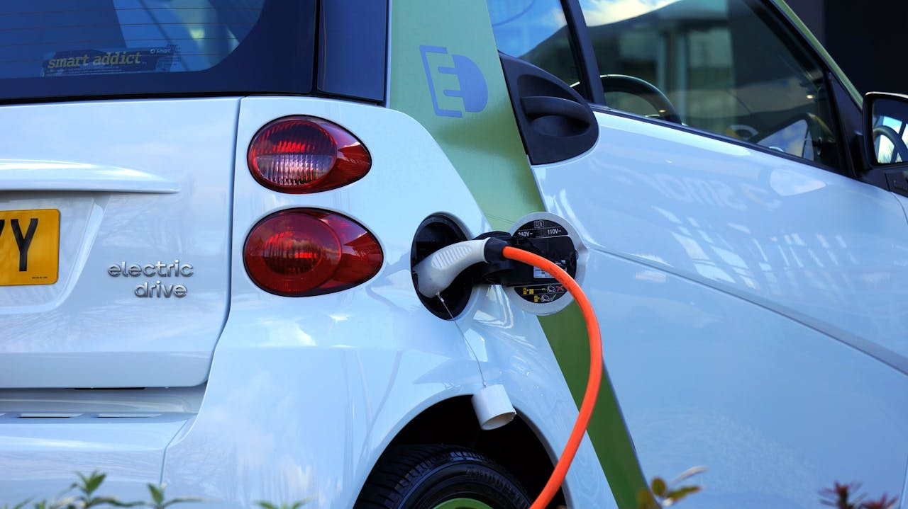

::: {.section-label}
Über uns
:::

# Erneuerbare Energien und innovative Lösungen für die Zukunft

---

## Unser Unternehmen

::: {.section-label}
Wer wir sind und was wir tun
:::

**Elektro-Glaser hat sich zum Ziel gesetzt, gerade kleinere Aufträge umzusetzen, für die sich schwer Elektriker finden lassen.**

Egal ob Wallbox, Balkonsolar mit oder ohne Speicher, Wärmepumpe oder große PV-Dachanlage – wir kommen gerne vorbei und prüfen, ob Ihre Elektroinstallation geeignet ist. Natürlich helfen wir auch bei allen Formalitäten.

Wir freuen uns auch, wenn Sie selbst einen Teil der Arbeit übernehmen möchten und wir uns auf das beschränken, was von einem Fachunternehmen durchgeführt werden muss.

::: {.feature-row}
::: {.feature-img}

:::
::: {.feature-text}
### Technik, die wirklich passt
Wir sind kein Konzern, sondern ein kleines Team mit echtem Interesse an Ihrer Situation. Was bei Ihnen sinnvoll ist – und was nicht – sagen wir Ihnen ehrlich. Auch wenn das mal bedeutet, dass wir weniger verdienen.
:::
:::

::: {.feature-row .reverse}
::: {.feature-img}

:::
::: {.feature-text}
### Energiewende im Alltag
Von der Wallbox in der Garage bis zur PV-Anlage auf dem Dach – wir machen die Energiewende greifbar und umsetzbar. Für Eigenheimbesitzer, Mieter und Unternehmen.
:::
:::

---

## Unsere Geschichte

Gegründet 2025 in Erlangen möchte Elektro-Glaser Ihr Partner vor Ort sein, wenn es um schnelle und unkomplizierte Hilfe, Beratung und Umsetzung der Energiewende geht.

::: {.usp-row}

::: {.usp-item}
::: {.usp-icon}
💶
:::
#### Transparente Preise
Wir garantieren faire und transparente Angebote. Alles, was Sie selbst erledigen dürfen, weisen wir optional aus.
:::

::: {.usp-item}
::: {.usp-icon}
💡
:::
#### Innovative Lösungen
Unsere Spezialisierung auf neueste Technologien im Bereich Smart Home und erneuerbare Energien sorgt für die besten Lösungen.
:::

::: {.usp-item}
::: {.usp-icon}
🤝
:::
#### Kundenzufriedenheit
Unser Ziel ist es, Sie vollständig zufriedenzustellen. Wir sind unabhängig und nicht an bestimmte Hersteller gebunden.
:::

:::

---

## Der Inhaber

**Daniel Glaser** ist Elektroingenieur und Familienvater mit einer Schwäche für Embedded-Systeme und ehrliche Handwerkskunst. Als geschäftsführender Gesellschafter der Elektro-Glaser GmbH verbindet er technisches Know-how mit dem Anspruch, Kunden wirklich zu verstehen – und nicht nur abzuarbeiten.

> *"Wir sind kein Konzern, sondern echte Macher und Vordenker. Uns ist wichtig, dass Sie bekommen, was am besten zu Ihnen passt."*

---

::: {.contact-box}
### Lernen Sie uns kennen

Haben Sie ein Projekt oder eine Frage? Wir freuen uns auf Ihre Nachricht.

::: {.contact-item}
📞 [+49 9131 911 6733](tel:+4991319116733)
:::
::: {.contact-item}
✉️ [info@e-glaser.de](mailto:info@e-glaser.de)
:::
::: {.contact-item}
📍 Birkenweg 12, 91058 Erlangen
:::

[Kontakt aufnehmen →](contact.qmd){.btn .btn-warning style="margin-top:1rem;color:#1e3a5f;font-weight:600;"}
:::
