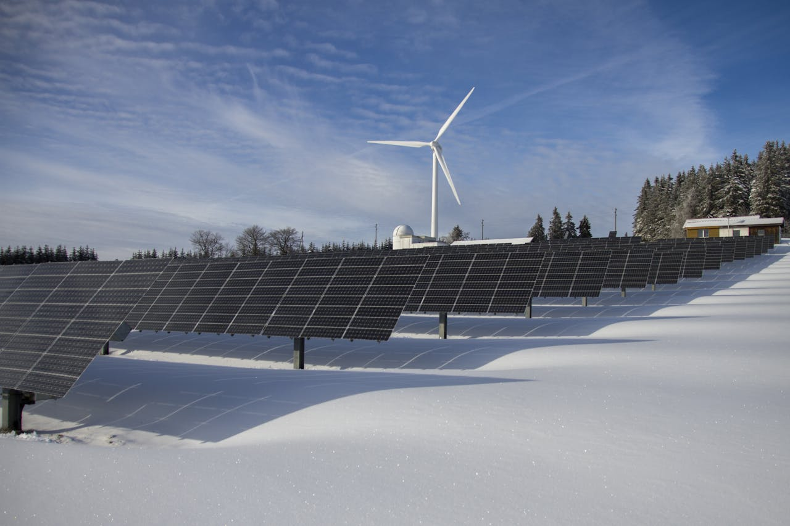

::: {.hero}
::: {.container}
::: {.hero-badge}
Ihr Partner in Erlangen & Umgebung
:::

# Strom mit Verstand.

Erneuerbare Energien · Smart Home · Elektromobilität

::: {.lead}
Wir sind ein inhabergeführter Elektrobetrieb aus Erlangen – mit Leidenschaft für zukunftsfähige Technik, klare Kommunikation und nachhaltige Lösungen. Vom Balkonsolar bis zur großen PV-Anlage, von der Wallbox bis zum Smart Home.
:::

[Jetzt Angebot anfragen](contact.qmd){.btn-hero}
:::
:::

---

::: {.container style="max-width:900px; margin:0 auto; padding:0 1.5rem;"}

## Unsere Kernleistungen {.text-center style="margin-bottom:0.3rem;"}
::: {.text-center .section-label}
Was wir für Sie tun
:::

::: {.service-grid}

::: {.service-card}
::: {.service-icon}
🌞
:::
### Photovoltaik & Balkonsolar
Von der kleinen Stecker-Solar-Anlage bis zur Dach-PV – wir prüfen, beraten und installieren. Eigenverbrauchsoptimierung inklusive.
:::

::: {.service-card}
::: {.service-icon}
🚗
:::
### Wallbox & E-Mobilität
Ladepunkt zuhause, Lastmanagement, Netzanschluss – alles aus einer Hand. Wir kennen alle Förderprogramme.
:::

::: {.service-card}
::: {.service-icon}
🏠
:::
### Smart Home
Automatisierung, Lichtsteuerung, Energiemonitoring – was wirklich sinnvoll ist (und was eher Spielerei bleibt).
:::

::: {.service-card}
::: {.service-icon}
🔌
:::
### Elektroinstallation
Ob neue Steckdose, Sicherungskasten oder komplette Unterverteilung – schnell, sauber, zuverlässig.
:::

:::

[Alle Dienstleistungen →](services.qmd){.btn .btn-outline-primary style="margin:1rem 0;"}

::: {.feature-row}
::: {.feature-img}

:::
::: {.feature-text}
### Erneuerbare Energien – von klein bis groß
Ob Balkonkraftwerk, Dach-PV mit Speicher oder Wärmepumpenanschluss: Wir begleiten Sie von der ersten Frage bis zur Inbetriebnahme. Inhabergeführt, herstellerunabhängig, ehrlich.

[Zu den Leistungen →](services.qmd){.btn .btn-warning style="margin-top:0.8rem;color:#1a1200;font-weight:600;"}
:::
:::

---

## Warum Elektro-Glaser? {.text-center style="margin-bottom:0.3rem;"}

::: {.usp-row}

::: {.usp-item}
::: {.usp-icon}
💶
:::
#### Transparente Preise
Faire Angebote – optional mit Angabe, was Sie selbst erledigen dürfen.
:::

::: {.usp-item}
::: {.usp-icon}
🔓
:::
#### Herstellerunabhängig
Wir empfehlen, was zu Ihnen passt – nicht, was uns die höchste Marge bringt.
:::

::: {.usp-item}
::: {.usp-icon}
🤝
:::
#### Auch kleine Aufträge
Wir nehmen Aufträge an, für die sich andere Elektriker oft nicht finden lassen.
:::

::: {.usp-item}
::: {.usp-icon}
💡
:::
#### Echte Beratung
Wir erklären, was Sinn macht – verständlich, ehrlich, ohne Fachchinesisch.
:::

:::

:::
