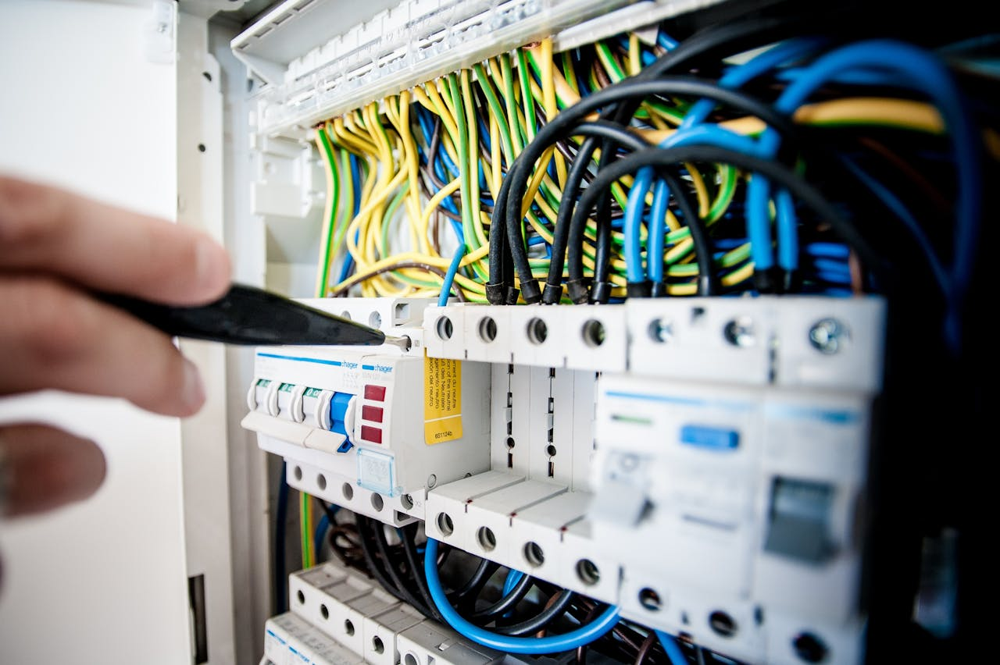

::: {.section-label}
Dienstleistungen
:::

# Innovative Lösungen für Ihre Elektrobedürfnisse

---

## Elektriker im Paket – einfach & unkompliziert

Warum müssen Dienstleistungen im Handwerk immer so kompliziert sein? Anrufen, erklären, Termin machen, Angebot einholen, annehmen, nochmal Termine... Geht es nicht auch einfach? Hier finden Sie eine Auswahl kleiner Elektriker-Pakete, die Sie schnell und unkompliziert anfragen können.

::: {.service-grid}

::: {.service-card}
::: {.service-icon}
🔆
:::
### Stecker-Solar-Check
Wir prüfen in wenigen Minuten, ob und wie eine Stecker-Solaranlage (Balkonkraftwerk) bei Ihnen möglich ist. Oft geht es „einfach so" – manchmal sind kleine Anpassungen nötig.

**Leistung:** Vor-Ort-Check, Beratung, Empfehlung geeigneter Geräte
:::

::: {.service-card}
::: {.service-icon}
🚗
:::
### Wallbox-Check & Installation
Wir prüfen Ihren Hausanschluss, empfehlen die passende Wallbox und übernehmen die Installation – inklusive Anmeldung beim Netzbetreiber.

**Leistung:** Hausanschluss-Check, Wallbox-Montage, Netzanmeldung
:::

::: {.service-card}
::: {.service-icon}
🌞
:::
### PV-Anlage & Speicher
Von der kleinen Dachanlage bis zur großen PV-Installation mit Batteriespeicher. Wir begleiten Sie von der Planung bis zur Inbetriebnahme.

**Leistung:** Planung, Anlagenauslegung, Montage, Netzanmeldung, Förderberatung
:::

::: {.service-card}
::: {.service-icon}
🏠
:::
### Smart Home & Automatisierung
Lichtsteuerung, smarte Steckdosen, Energiemonitoring – wir zeigen Ihnen, was wirklich sinnvoll ist und was eher Spielerei bleibt.

**Leistung:** Beratung, Installation, Konfiguration
:::

::: {.service-card}
::: {.service-icon}
🔌
:::
### Elektroinstallation
Steckdosen, Leitungsverlegung, Sicherungskasten, Unterverteilung – alle klassischen Elektroarbeiten, schnell und sauber ausgeführt.

**Leistung:** Neu- und Erweiterungsinstallation, Prüfung bestehender Anlagen
:::

::: {.service-card}
::: {.service-icon}
♻️
:::
### Wärmepumpen-Anschluss
Elektrischer Anschluss von Wärmepumpen, Prüfung des Hausanschlusses auf Eignung, Abstimmung mit Netzbetreiber nach § 14a EnWG.

**Leistung:** Anschluss, Anmeldung, Abstimmung Netzbetreiber
:::

:::

---

## Unsere Schwerpunkte im Detail

::: {.feature-row}
::: {.feature-img}

:::
::: {.feature-text}
### Erneuerbare Energien
Von der kleinen Stecker-Solar-Anlage bis zur großen Dach-PV mit Batteriespeicher – wir kennen alle Förderprogramme und begleiten Sie durch den gesamten Prozess: Planung, Anmeldung, Montage, Inbetriebnahme.
:::
:::

::: {.feature-row .reverse}
::: {.feature-img}

:::
::: {.feature-text}
### Elektromobilität & Wallbox
Wir prüfen Ihren Hausanschluss, empfehlen die passende Ladestation und übernehmen Montage sowie Anmeldung beim Netzbetreiber. Auf Wunsch mit Lastmanagement und PV-Überschussladen.
:::
:::

::: {.feature-row}
::: {.feature-img}

:::
::: {.feature-text}
### Elektroinstallation
Ob einzelne Steckdose, neue Unterverteilung oder komplette Neuinstallation – wir erledigen klassische Elektroarbeiten schnell und sauber. Auch für Arbeiten, für die andere Elektriker zu selten Zeit haben.
:::
:::

::: {.feature-row .reverse}
::: {.feature-img}

:::
::: {.feature-text}
### Smart Home & Automatisierung
Wir gestalten Ihr Zuhause smarter – mit modernen Lösungen für Lichtsteuerung, Energiemonitoring und Automatisierung. Wir sagen Ihnen ehrlich, was wirklich Sinn ergibt und was eher Spielerei bleibt.
:::
:::

---

## Nützliche Tools

::: {.callout-tip}
### EEG Schaltpläne – kostenlos & online
Unsere kleine Web-App visualisiert EEG-Messkonzepte und Schaltpläne auf Knopfdruck. Einfach Anlagetyp auswählen – fertig.

👉 **[eegschaltplaene.streamlit.app](https://eegschaltplaene.streamlit.app/){target="_blank"}**
:::

---

::: {.contact-box}
### Ihr Projekt ist nicht dabei?

Kein Problem – sprechen Sie uns einfach an. Wir finden gemeinsam die beste Lösung.

::: {.contact-item}
📞 [+49 9131 911 6733](tel:+4991319116733)
:::
::: {.contact-item}
✉️ [info@e-glaser.de](mailto:info@e-glaser.de)
:::

[Anfrage stellen →](contact.qmd){.btn .btn-warning style="margin-top:1rem;color:#1e3a5f;font-weight:600;"}
:::
